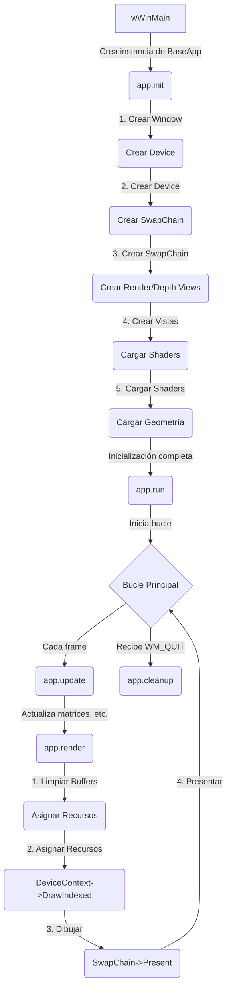
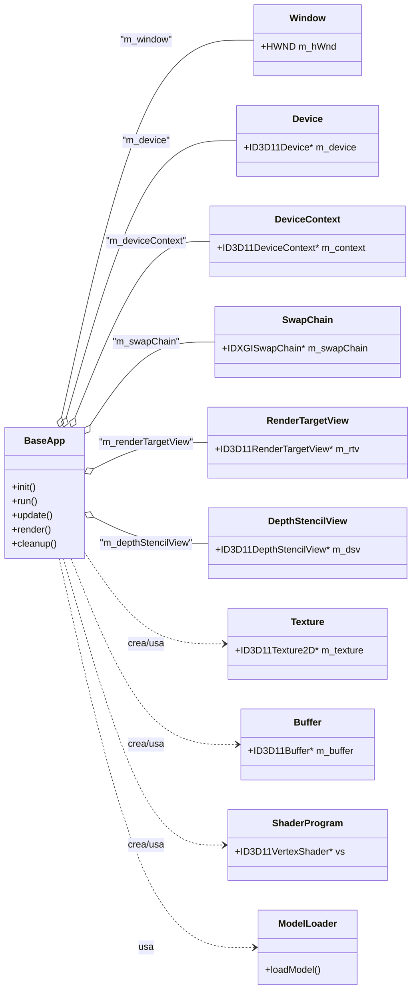

# 🎮 Pandora Core Engine ✨

      

             

Pandora Core Engine es un motor de renderizado 3D construido desde cero en C++ utilizando DirectX 11. Creado para la materia "Gráficas Computacionales 3D" (Generación 2026), este motor implementa un pipeline de renderizado en tiempo real para mostrar un cubo texturizado en rotación.

## 📜 Tabla de Contenidos

  * [🚀 Características Principales](https://www.google.com/search?q=%23-caracter%C3%ADsticas-principales)
  * [🏗️ Arquitectura del Motor](https://www.google.com/search?q=%23%EF%B8%8F-arquitectura-del-motor)
  * [📊 Diagramas de Arquitectura](https://www.google.com/search?q=%23-diagramas-de-arquitectura)
      * [Diagrama de Flujo de Ejecución](https://www.google.com/search?q=%231-diagrama-de-flujo-de-ejecuci%C3%B3n)
      * [Diagrama de Clases (Abstracción)](https://www.google.com/search?q=%232-diagrama-de-clases-abstracci%C3%B3n)
  * [🎨 Pipeline de Renderizado](https://www.google.com/search?q=%23-pipeline-de-renderizado)
  * [⚙️ Compilar y Ejecutar](https://www.google.com/search?q=%23%EF%B8%8F-compilar-y-ejecutar)

## 🚀 Características Principales

  * **Abstracción de DirectX 11:** Clases C++ limpias y reutilizables que encapsulan los componentes de bajo nivel de la API (Device, Buffers, Textures, etc.).
  * **Clase `BaseApp`:** Orquesta toda la lógica de la aplicación, incluyendo la inicialización, el bucle principal (`run`), actualización (`update`) y renderizado (`render`).
  * **Pipeline de Renderizado Mínimo:**
      * Creación de ventana nativa Win32 (`Window`).
      * Gestión de `Device` y `DeviceContext`.
      * Configuración de `SwapChain`.
      * Manejo de `RenderTargetView` y `DepthStencilView`.
  * **Renderizado de Geometría:** Carga y dibuja mallas usando `Buffer` para vértices e índices.
  * **Shaders y Texturizado:** Carga y administra Vertex y Pixel Shaders (`ShaderProgram`) escritos en HLSL.
  * **Carga de Modelos:** Incluye un `ModelLoader` básico para cargar geometría.
  * **Soporte MSAA:** Configura multisample anti-aliasing para suavizar los bordes.

## 🏗️ Arquitectura del Motor

El motor utiliza el principio de separación de responsabilidades. La lógica de la aplicación (`BaseApp`) posee y gestiona las clases de abstracción de bajo nivel de DirectX.

| Clase | Descripción |
| :--- | :--- |
| **`BaseApp`** | **Orquestador principal.** Inicializa todos los sistemas, maneja el bucle de mensajes de Windows y llama a `update()` y `render()` cada fotograma. |
| `Window` | Encapsula la creación y el manejo de la ventana nativa de Win32 (HWND). |
| `Device` | Fábrica para los recursos de la GPU (texturas, búferes, shaders). Envuelve `ID3D11Device`. |
| `DeviceContext` | Envía comandos a la GPU y asigna recursos al pipeline. Envuelve `ID3D11DeviceContext`. |
| `SwapChain` | Gestiona la cadena de búferes (front/back buffer) para la presentación. |
| `Texture` | Representa recursos de texturas 2D y sus vistas (`ShaderResourceView`). |
| `RenderTargetView` | Búfer de color (generalmente el back buffer) donde se dibuja la escena. |
| `DepthStencilView` | Búfer de profundidad/plantilla usado para la oclusión correcta. |
| `Buffer` | Clase genérica para búferes de la GPU (Vertex, Index, Constant Buffers). |
| `ShaderProgram` | Administra un par de Vertex y Pixel Shaders compilados. |
| `InputLayout` | Define cómo la GPU debe interpretar los datos del buffer de vértices. |
| `ModelLoader` | Utilidad para cargar datos de geometría (vértices/índices) desde archivos. |
| `MeshComponent`| Representa una malla renderizable (conjunto de búferes y texturas). |

## 📊 Diagramas de Arquitectura

#### 1\. Diagrama de Flujo de Ejecución

Este diagrama muestra el flujo de control de la aplicación, comenzando desde el punto de entrada `wWinMain` hasta el bucle de renderizado dentro de `BaseApp`.

#### 2\. Diagrama de Clases (Abstracción)

Este diagrama muestra las relaciones de propiedad entre la clase `BaseApp` y los componentes de bajo nivel que abstrae.

## 🎨 Pipeline de Renderizado

Cada fotograma sigue este flujo de ejecución dentro de `BaseApp::render()`:

1.  **Actualización:** `BaseApp::update()` actualiza las matrices de transformación (Mundo, Vista, Proyección).
2.  **Limpiar Buffers:** Se limpian el `RenderTargetView` y el `DepthStencilView`.
3.  **Asignar Recursos (Binding):**
      * Input Layout, Vertex Buffer e Index Buffer.
      * Vertex Shader y Pixel Shader (`ShaderProgram`).
      * Constant Buffers (con las matrices actualizadas).
      * Texturas y Samplers.
4.  **Llamada de Dibujado:** Se invoca a `DeviceContext::DrawIndexed()` para renderizar la geometría.
5.  **Presentar:** Se llama a `SwapChain::Present()` para intercambiar los búferes y mostrar el nuevo fotograma.

## ⚙️ Compilar y Ejecutar

### Prerrequisitos

  * Windows 10 o superior.
  * Visual Studio 2010 o una versión más reciente.
  * **DirectX SDK (Junio 2010)**. Es crucial tener este SDK instalado, ya que el proyecto utiliza componentes heredados como D3DX11.

### Compilación

1.  Clonar el repositorio.
2.  Asegurarse de que las rutas del DirectX SDK (Junio 2010) estén correctamente configuradas en las propiedades del proyecto en Visual Studio (`Include` y `Library Directories`).
3.  Abrir el archivo de solución `PandoraCoreEngine_2010.sln`.
4.  Compilar el proyecto en la configuración deseada (Debug o Release).

-----
